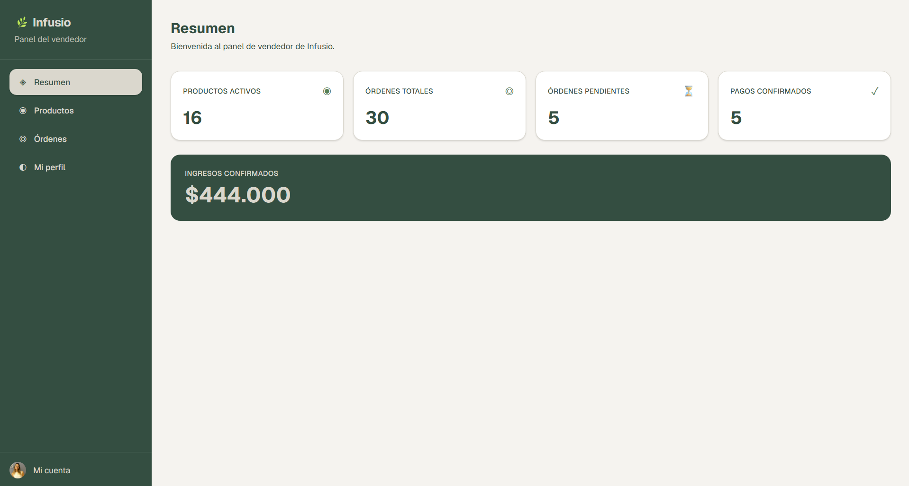

# Dashboard — Resumen

Página principal del panel de vendedor (`/dashboard`). Muestra un resumen del estado actual del negocio en tiempo real, calculado desde la base de datos en cada visita (Server Component).

## Métricas

| Tarjeta | Qué muestra |
|---------|-------------|
| Productos activos | Cantidad de productos con `isActive = true` del vendedor |
| Órdenes totales | Total de órdenes recibidas |
| Órdenes pendientes | Órdenes en estado `PENDING` (esperando pago) |
| Pagos confirmados | Órdenes en estado `PAYMENT_CONFIRMED` listas para preparar |

## Ingresos confirmados

Suma del `totalAmount` de todas las órdenes en estados `PAYMENT_CONFIRMED`, `PREPARING`, `DISPATCHED` y `DELIVERED`. No incluye órdenes `PENDING` ni `CANCELLED`.

Todos los datos están filtrados por el `sellerId` del usuario autenticado, por lo que cada vendedor ve únicamente sus propios números.
