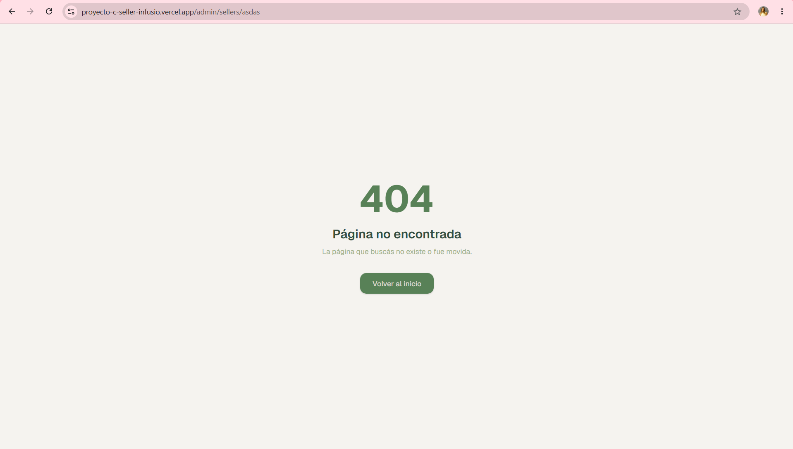

# Manejo de errores y validaciones

## Páginas de error

### 404 — Página no encontrada

`app/not-found.tsx` — se muestra automáticamente cuando Next.js no encuentra una ruta, o cuando se llama a `notFound()` explícitamente (por ejemplo, al intentar acceder al detalle de una orden que no existe).

### Error general
`app/error.tsx` — error boundary global que captura cualquier excepción no manejada en el árbol de componentes. Muestra un mensaje genérico con dos opciones: reintentar la operación o volver al dashboard.

---

## Validación del lado del servidor

Todos los endpoints de la API validan los datos recibidos antes de tocar la base de datos. Los errores devuelven un JSON con `{ error: "descripción" }` y el código HTTP correspondiente.

### Productos (`POST /api/seller/products`)

| Validación | Error | Código |
|------------|-------|--------|
| `name`, `price` o `stock` ausentes | "Faltan campos requeridos: name, price, stock" | 400 |
| `price` o `stock` negativos | "Precio y stock deben ser mayores a 0" | 400 |
| Usuario no autenticado | "No autorizado" | 401 |
| Vendedor sin perfil creado | "Completá tu perfil de vendedor antes de crear productos" | 400 |

### Perfil (`PATCH /api/seller/profile`)

| Validación | Error | Código |
|------------|-------|--------|
| `name`, `address` o `postalCode` ausentes | "Faltan campos requeridos: nombre, dirección y código postal" | 400 |
| Usuario no autenticado | "No autorizado" | 401 |

### Orden de compra (`POST /api/seller/purchase_order`)

| Validación | Error | Código |
|------------|-------|--------|
| `shopping_cart_id`, `user_id`, `cart_items` o `address` ausentes | "Faltan campos requeridos: ..." | 400 |
| `cart_items` vacío o no es array | "cart_items debe ser un array no vacío" | 400 |

### Error interno
Todos los endpoints tienen un bloque `try/catch` que devuelve `500` ante cualquier error inesperado, sin exponer detalles internos al cliente.
