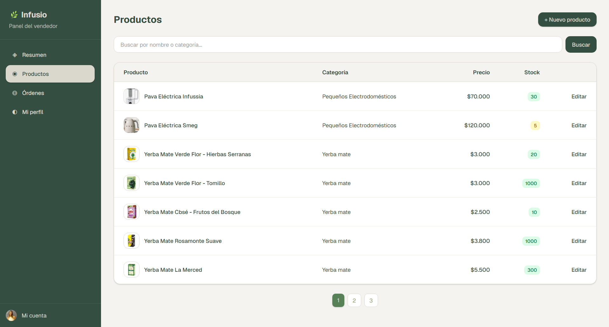
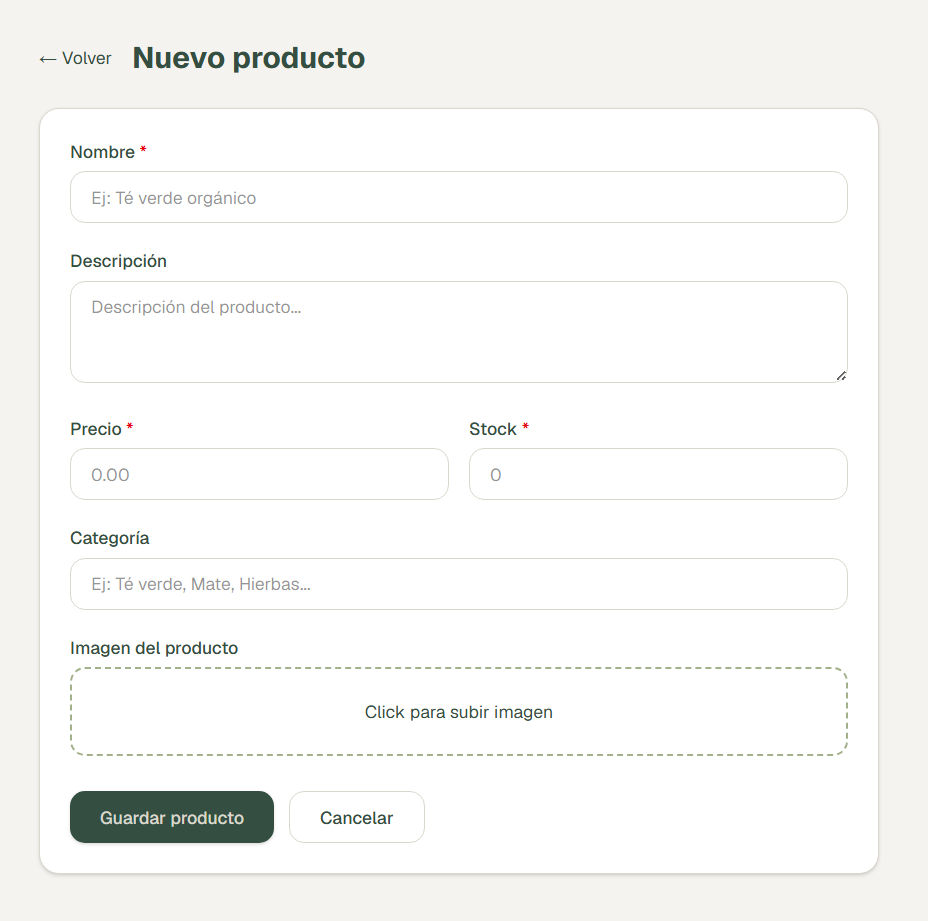

# Gestión de productos

El vendedor puede crear, editar y dar de baja sus productos desde `/dashboard/products`.

## Listado

- Muestra los productos activos del vendedor con imagen, nombre, categoría, precio y stock.
- **Búsqueda** por nombre o categoría en tiempo real (parámetro `search` en la URL).
- **Paginación** de 7 productos por página (parámetro `page` en la URL).
- Badge de stock con colores: verde (>5), amarillo (1–5), rojo (0).

## Crear producto

Formulario en `/dashboard/products/new` con los campos:

| Campo | Requerido | Descripción |
|-------|-----------|-------------|
| Nombre | ✅ | Nombre del producto |
| Descripción | — | Texto libre |
| Precio | ✅ | Número decimal |
| Stock | ✅ | Número entero |
| Categoría | — | Texto libre (ej: "Té verde", "Mate") |
| Imagen | — | Subida via Cloudinary |

## Editar producto

Mismo formulario en `/dashboard/products/[id]`. Incluye botón de eliminación (baja lógica: `isActive = false`).

## Imagen

Las imágenes se suben a [Cloudinary](https://cloudinary.com) usando `next-cloudinary`. La URL resultante se guarda en `imageUrl` del producto. No se almacenan imágenes en la base de datos propia.
